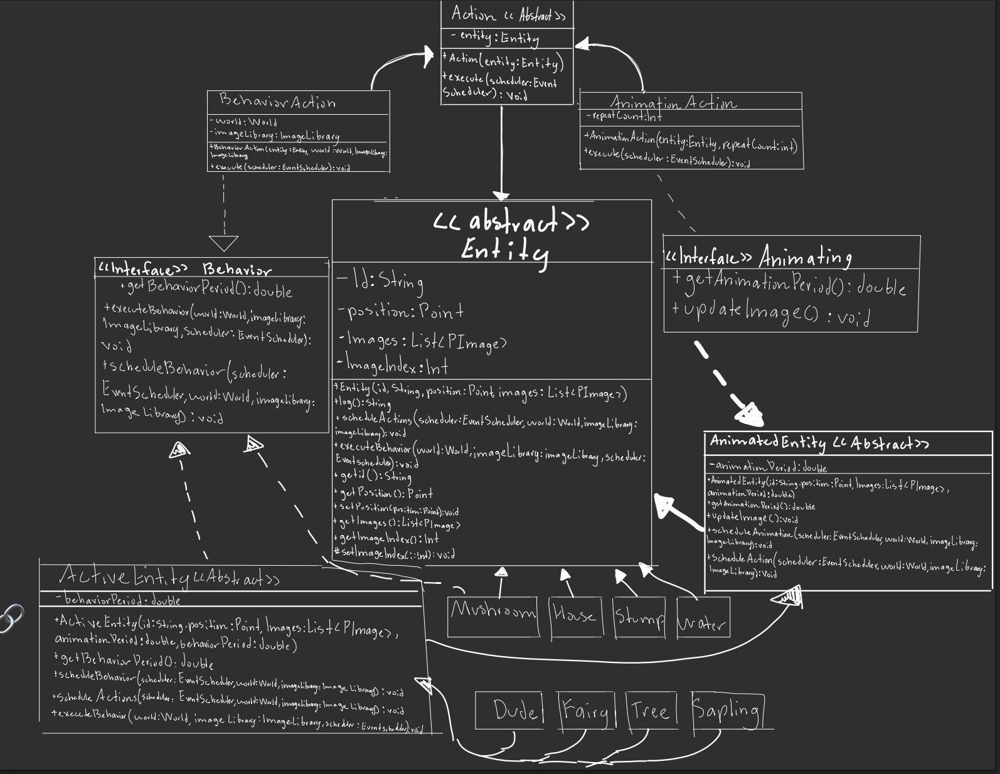

# Java Object-Oriented Virtual World

An object-oriented simulation engine built in Java featuring entity scheduling, animation cycles, and world interactions.

---

## UML Evolution

### Original UML

### Final UML

---

## Refactor Summary

From my original UML to my final design, I removed the enum-based entity kind system and replaced it with a proper class hierarchy where each entity type (Dude, Fairy, Tree, Sapling, etc.) has its own class and overrides its own behavior.

I moved animation logic out of the base Entity class and into AnimatedEntity so only entities that actually animate handle image updates.

The Behavior interface was simplified so it only defines behavior methods and does not store any data.

I split scheduling logic between AnimatedEntity and ActiveEntity instead of using switch statements, improving cohesion and extensibility.